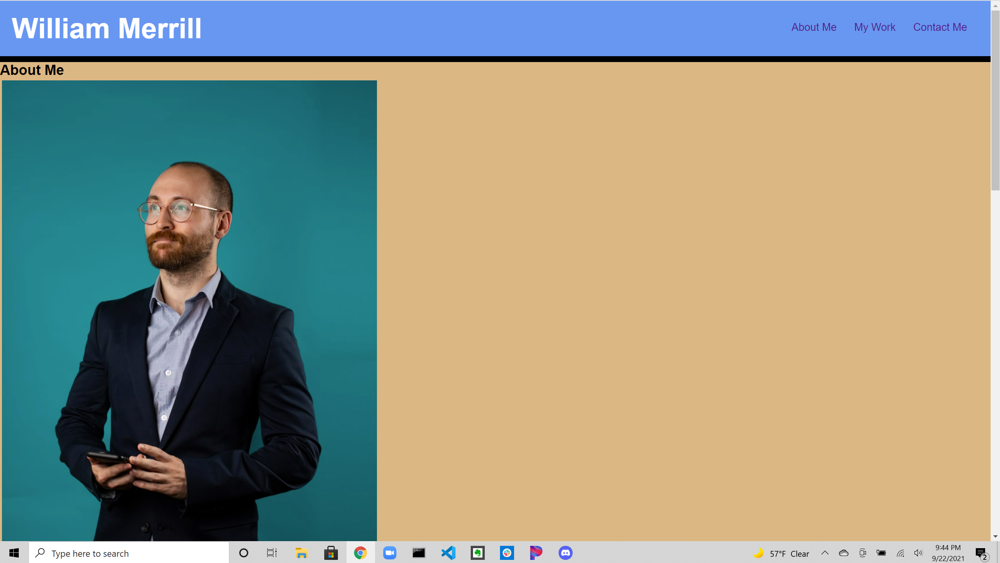

# DevPortfolio
 

## Objective

I created a portfolio page that will respond to different screen sizes with links to my work and how to contact me. It has a CSS style sheet attatched.

## Screenshot

## Link to deployed page

[Here is the link to my deployed code](https://wmerrill01.github.io/DevPortfolio/)